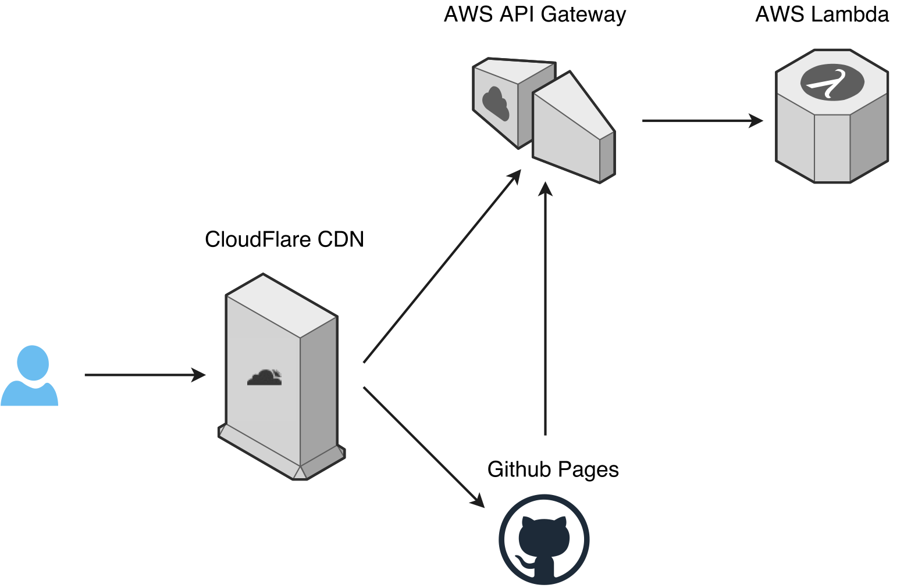

# XKCD Excuse Generator

Generate your own excuse in a nifty comic style!

[](https://circleci.com/gh/mislavcimpersak/xkcd-excuse-generator/tree/master)
[](https://coveralls.io/github/mislavcimpersak/xkcd-excuse-generator?branch=hotfix%2Fci_cov)

-----

Go to [xkcd-excuse.com](https://xkcd-excuse.com) and go from this:


to this:


using a simple form!

-----

Originaly created as an example for [Python Hrvatska meetup](https://www.meetup.com/Python-Hrvatska/events/242639630/) held on September 12, 2017 and for [Python Belgrade meetup](https://www.meetup.com/PythonBelgrade/events/243547584/) held on September 29, 2017 on which I gave [a talk](https://mislavcimpersak.github.io/serverless-talk/) on serverless technology.

-----

Error monitoring provided by [Bugsnag](https://www.bugsnag.com) ❤️

<a href="https://www.bugsnag.com"></a>

-----

This repo is the backend part of the [xkcd-excuse.com](https://xkcd-excuse.com) project. Code for the frontend part can be found in [xkcd-excuse-front](https://github.com/mislavcimpersak/xkcd-excuse-front) repo.

## API Usage

If you are feeling extra wild you can use the API directly.

Send `who`, `why` and `what` with desired text as GET parameters to `https://function.xkcd-excuse.com/v1/excuse`

Example:
```
https://function.xkcd-excuse.com/v1/excuse/?who=programmer&why=my%20code%20is%20compiling&what=compiling
```

You get the simplest api response in the world:

```
{
    data: {
        image_url: "https://function.xkcd-excuse.com/media/50524f4752414d4d4552-4d5920434f444520495320434f4d50494c494e47-434f4d50494c494e47.png"
    }
}
```

Follow the given `image_url` value to get your excuse image.

## Tech

Run with Python 3.6, created using [Hug Framework](https://github.com/timothycrosley/hug), packaged with [Zappa](https://github.com/Miserlou/Zappa/) and served from AWS Lambda.

For frontend tech checkout the [XKCD excuse front](https://github.com/mislavcimpersak/xkcd-excuse-front#tech) repo's README.


### Infrastructure

Since this is a side project that will obviously never make any money, costs should idealy be minimal. Everything is served behind CloudFlare CDN, even the API that is served from AWS Lambda through AWS API Gateway. Frontend is served on Github Pages.



## Legal

### Original image

[Original image](https://xkcd.com/303/) created by Randall Munroe from XKCD.

Released under [Creative Commons Attribution-NonCommercial 2.5 License](https://creativecommons.org/licenses/by-nc/2.5/).

### Font

[XKCD-Font](https://github.com/ipython/xkcd-font) created by iPython team.

Released under [Creative Commons Attribution-NonCommercial 3.0 License](https://creativecommons.org/licenses/by-nc/3.0/).

