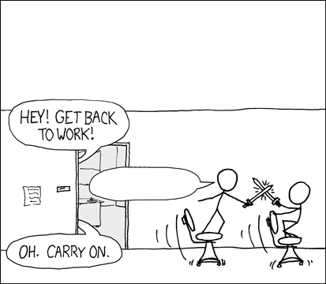

# XKCD Excuse Generator

Generate your own excuse in a nifty comic style!

[](https://circleci.com/gh/mislavcimpersak/xkcd-excuse-generator/tree/master)
[](https://coveralls.io/github/mislavcimpersak/xkcd-excuse-generator?branch=hotfix%2Fci_cov)

-----

From this:



to this:


through simple API!

## Usage

Send `who`, `why` and `what` with desired text as GET parameters to `/v1/excuse`.

Example:
```
https://function.xkcd-excuse.com/v1/excuse/?who=programmer&why=my%20code%20is%20compiling&what=compiling
```

You get the simplest api response in the world:

```
{
    data: {
        image_url: "https://function.xkcd-excuse.com/media/50524f4752414d4d4552-4d5920434f444520495320434f4d50494c494e47-434f4d50494c494e47.png"
    }
}
```

Follow the given `image_url` value to get your excuse image.

-----

Originaly created for [Python Hrvatska meetup](https://www.meetup.com/Python-Hrvatska/events/242639630/) held on September 12, 2017 and for [Python Belgrade meetup](https://www.meetup.com/PythonBelgrade/events/243547584/) held on September 29, 2017 on which I gave [a talk](https://mislavcimpersak.github.io/serverless-talk/) on serverless technology.

## Tech

Run with Python 3.6, created using [Hug Framework](https://github.com/timothycrosley/hug), packaged with [Zappa](https://github.com/Miserlou/Zappa/) and served from AWS Lambda.

## Legal

### Original image

[Original image](https://xkcd.com/303/) created by Randall Munroe from XKCD.

Released under [Creative Commons Attribution-NonCommercial 2.5 License](https://creativecommons.org/licenses/by-nc/2.5/).

### Font

[XKCD-Font](https://github.com/ipython/xkcd-font) created by iPython team.

Released under [Creative Commons Attribution-NonCommercial 3.0 License](https://creativecommons.org/licenses/by-nc/3.0/).

